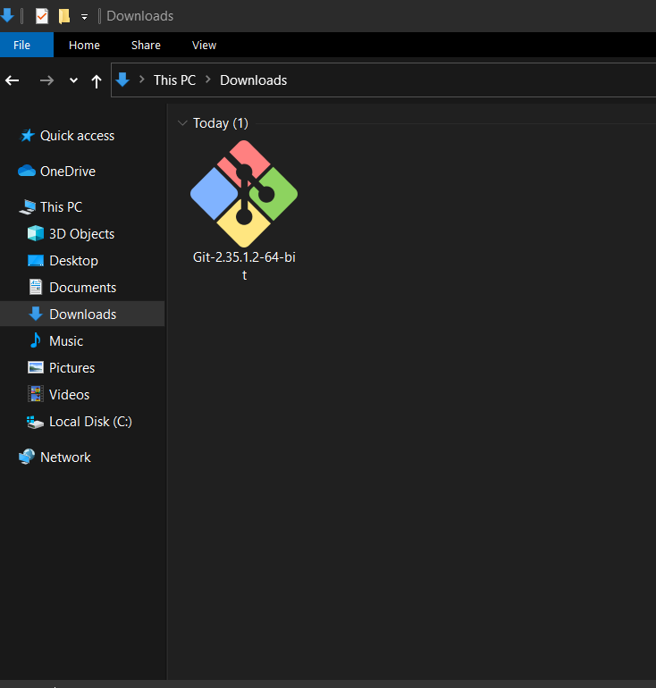
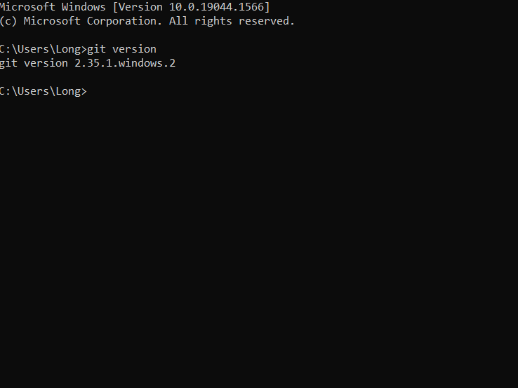
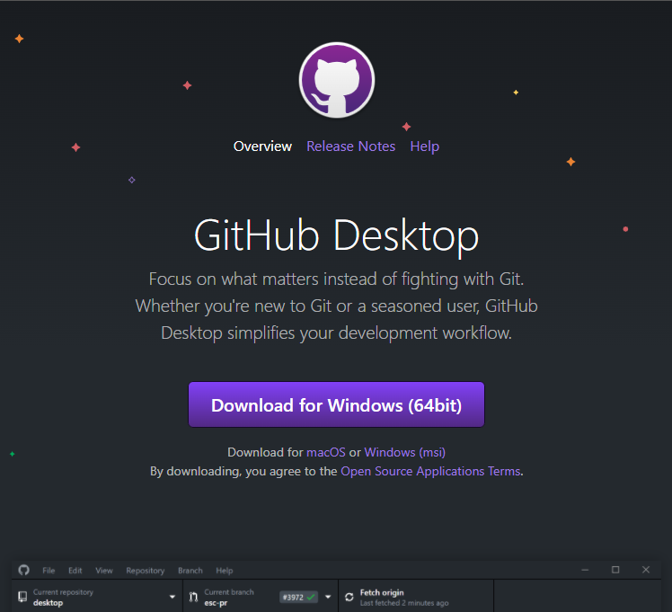
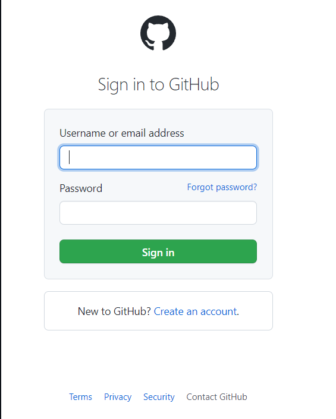
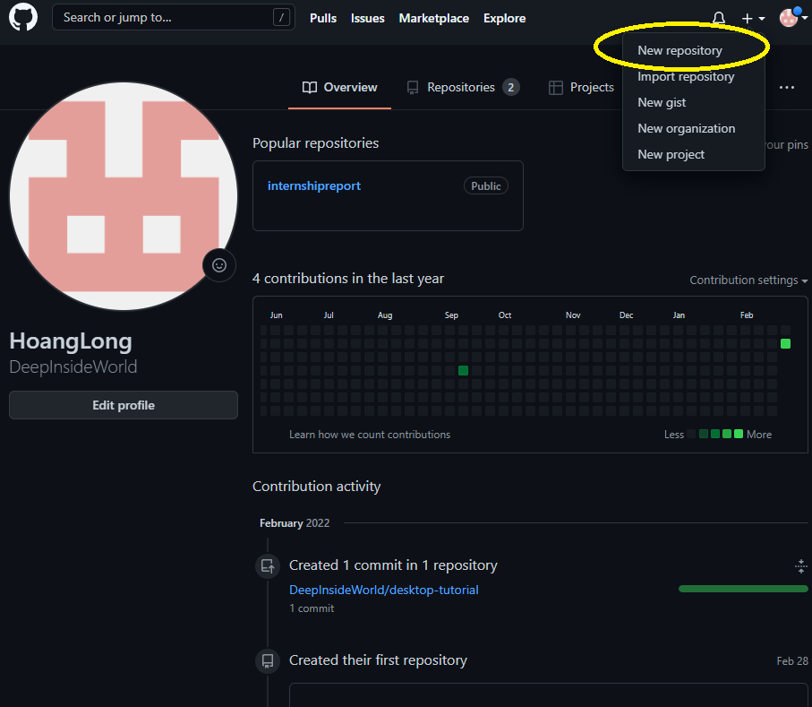
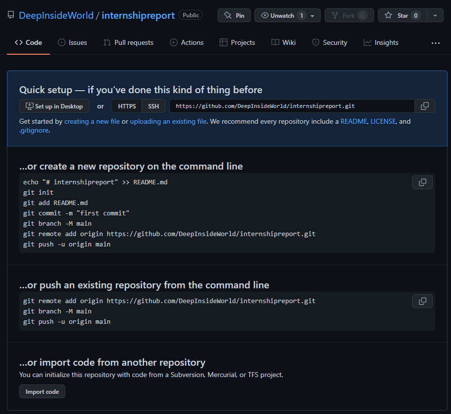
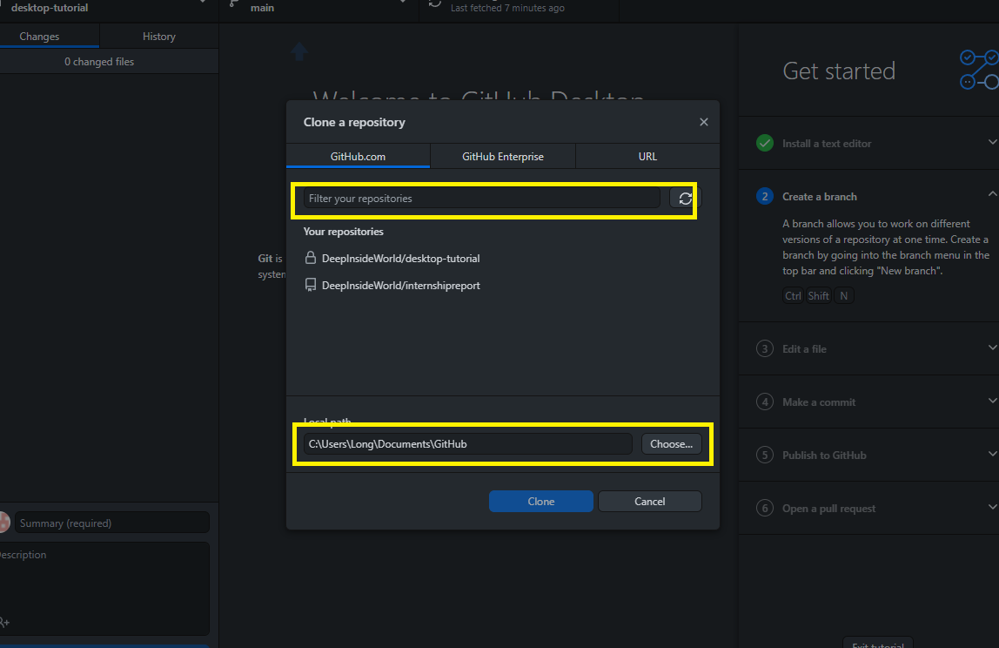
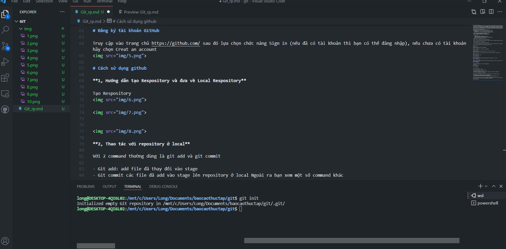
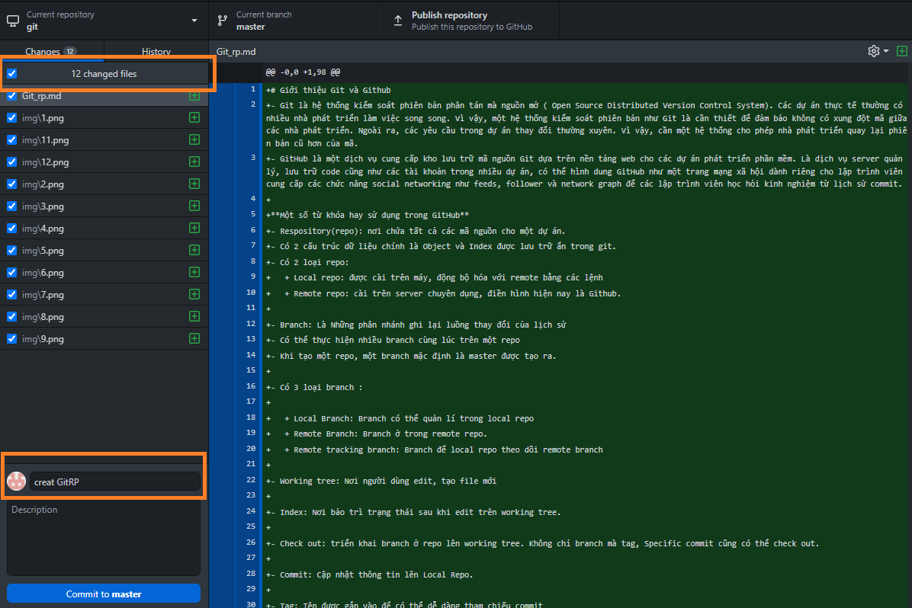

# Giới thiệu Git và Github
- Git là hệ thống kiểm soát phiên bản phân tán mà nguồn mở ( Open Source Distributed Version Control System). Các dự án thực tế thường có nhiều nhà phát triển làm việc song song. Vì vậy, một hệ thống kiểm soát phiên bản như Git là cần thiết để đảm bảo không có xung đột mã giữa các nhà phát triển. Ngoài ra, các yêu cầu trong dự án thay đổi thường xuyên. Vì vậy, cần một hệ thống cho phép nhà phát triển quay lại phiên bản cũ hơn của mã.
- GitHub là một dịch vụ cung cấp kho lưu trữ mã nguồn Git dựa trên nền tảng web cho các dự án phát triển phần mềm. Là dịch vụ server quản lý, lưu trữ code cũng như các tài khoản trong nhiều dự án, có thể hình dung GitHub như một trang mạng xã hội dành riêng cho lập trình viên cung cấp các chức năng social networking như feeds, follower và network graph để các lập trình viên học hỏi kinh nghiệm từ lịch sử commit.

**Một số từ khóa hay sử dụng trong GitHub**
- Respository(repo): nơi chứa tất cả các mã nguồn cho một dự án.
- Có 2 cấu trúc dữ liệu chính là Object và Index được lưu trữ ẩn trong git.
- Có 2 loại repo: 
	+ Local repo: được cài trên máy, động bộ hóa với remote bằng các lệnh
	+ Remote repo: cài trên server chuyên dụng, điền hình hiện nay là Github.

- Branch: Là Những phân nhánh ghi lại luồng thay đổi của lịch sử
- Có thể thực hiện nhiều branch cùng lúc trên một repo
- Khi tạo một repo, một branch mặc định là master được tạo ra.

- Có 3 loại branch : 

	+ Local Branch: Branch có thể quản lí trong local repo
	+ Remote Branch: Branch ở trong remote repo.
	+ Remote tracking branch: Branch để local repo theo dõi remote branch

- Working tree: Nơi người dùng edit, tạo file mới

- Index: Nơi bảo trì trạng thái sau khi edit trên working tree.

- Check out: triển khai branch ở repo lên working tree. Không chỉ branch mà tag, Specific commit cũng có thể check out.

- Commit: Cập nhật thông tin lên Local Repo.

- Tag: Tên được gắn vào để có thể dễ dàng tham chiếu commit

- Revision: Giá trị hash(hash value) được tạo ra mỗi lần commit, trên Git sử dụng hash value và thực hiện quản lí theo thế hệ.

- Head: Từ chỉ định commit mới nhất của branch đang check out hiện tại.

# Cài đặt Git 
**Bước 1: tải Git**

Truy cập vào link : https://git-scm.com/downloads

tùy thuộc vào hệ điều hành sẽ lựa chọn bản cài đặt phù hợp.

**Bước 2: Cài đặt**

Trong mục Download sẽ thấy một bản Git định dạng là .exe (ở đây là bản Git-2.35.1.2)

Trong quá trình cài đặt sẽ có một số option, tùy thuộc vào mỗi người sẽ có một cách cài đặt khác nhau.

**Bước 3: kiểm tra**

Mở cmd và gõ lệnh: git version 

Như trên đã thành công 

# Cài đặt GitHub Desktop
**Bước 1: Truy cập vào đường dẫn https://desktop.github.com/ để tải GitHub về và cài đặt.**

# Đăng ký tài khoản GitHub

Truy cập vào trang chủ https://github.com/ sau đó lựa chọn chức năng Sign in (nếu đã có tài khoản thì bạn có thể đăng nhập), nếu chưa có tài khoản hãy chọn Creat an account

# Cách sử dụng github

**1, Hướng dẫn tạo Respository và đưa về Local Respository**

Tạo Respository

**2, Thao tác với repository ở local**

Với 2 command thường dùng là git add và git commit

- Git add: add file đã thay đổi vào stage
- Git commit các file đã add vào stage lên repository ở local Ngoài ra bạn xem một số command khác

**3, Làm việc với repository ở server GitHub**

Cuối cùng khi có một bản ổn định và hoàn tất ta sẽ quyết định cập nhật nó lên repository server với:

- push: push thay đổi từ repository local lên repository server.
- fetch: cập nhật thay đổi từ repository server về repository local.
- pull/rebase: sao chép source code từ server về local workspace (tương đương checkout của SVN).

**4, Để đưa Clone Respository từ Server về Local Respository (Github desktop).Trước tiên ta cần tạo 1 thư mục trên máy tính để lưu trữ Respository được đưa từ Server về. Ở đây mình tạo thư mục Trần Dương ngoài Desktop**
 

# sử dụng GitHub Desk để thao tác qua lại giữa Local Respository và Git Server.

Đưa dữ liệu vào local Respository đã tạo

Ta có thể dùng Visual Studio Code đăng nhập với tài khoản Git đã tạo và viết project để nạp dữ liệu cho Local Respository trong GitHub Desktop

Github đã nhận được thay đổi của local Respository

- ghi chú cho dữ liệu và nhấn Commit để thực thi
- Sau đó để up dữ liệu từ local Respository lên Server thì ta nhấn Publish branch

Như trên ta đã hoàn thành đẩy dữ liệu từ LocalRepo lên Git Server